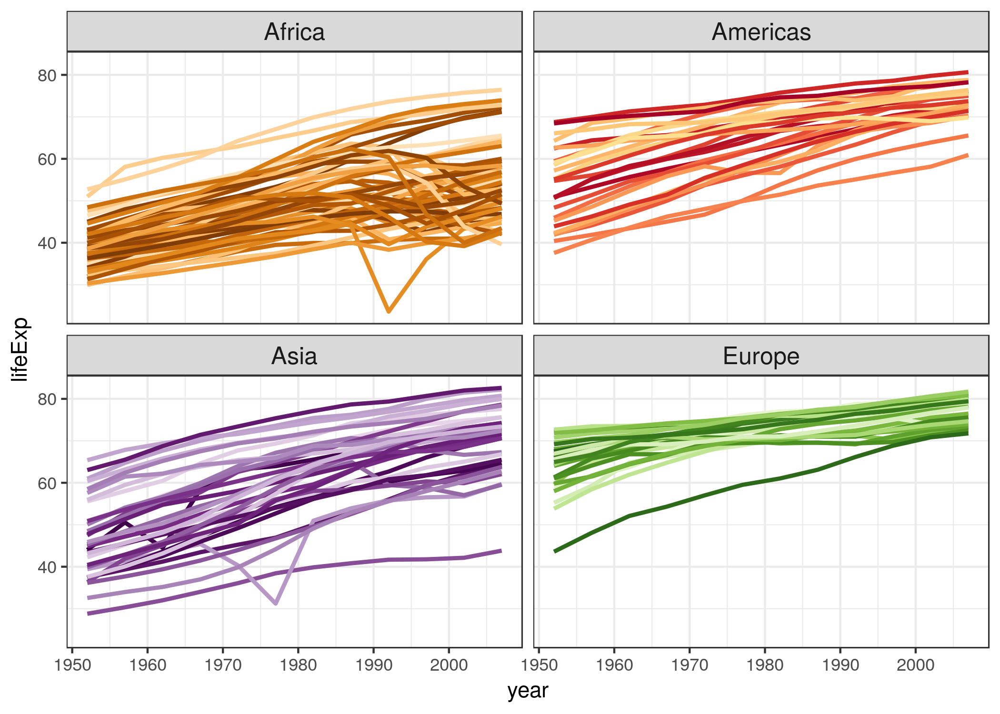

-   [gapminder](#gapminder)
    -   [Install and test drive](#install-and-test-drive)
    -   [Color schemes for countries and continents](#color-schemes-for-countries-and-continents)
    -   [How to use color scheme in `ggplot2`](#how-to-use-color-scheme-in-ggplot2)
    -   [How to use color scheme in base graphics](#how-to-use-color-scheme-in-base-graphics)
    -   [ISO 3166-1 country codes](#iso-3166-1-country-codes)
    -   [What is `gapminder` good for?](#what-is-gapminder-good-for)
    -   [How this sausage was made](#how-this-sausage-was-made)
    -   [Plain text delimited files](#plain-text-delimited-files)
    -   [License](#license)
    -   [Citation](#citation)
    
[](https://doi.org/10.5281/zenodo.594018)
[](http://cran.r-project.org/package=gapminder)


# gapminder

Excerpt from the [Gapminder](http://www.gapminder.org/data/) data. The
main object in this package is the `gapminder` data frame or “tibble”.
There are other goodies, such as the data in tab delimited form, a
larger unfiltered dataset, premade color schemes for the countries and
continents, and ISO 3166-1 country codes.

The `gapminder` data frames include six variables, ([Gapminder.org
documentation page](http://www.gapminder.org/data/documentation/)):

| variable  | meaning                  |
| :-------- | :----------------------- |
| country   |                          |
| continent |                          |
| year      |                          |
| lifeExp   | life expectancy at birth |
| pop       | total population         |
| gdpPercap | per-capita GDP           |

Per-capita GDP (Gross domestic product) is given in units of
[international
dollars](http://en.wikipedia.org/wiki/Geary%E2%80%93Khamis_dollar), “a
hypothetical unit of currency that has the same purchasing power parity
that the U.S. dollar had in the United States at a given point in time”
– 2005, in this case.

Package contains two main data frames or tibbles:

  - `gapminder`: 12 rows for each country (1952, 1955, …, 2007). It’s a
    subset of …
  - `gapminder_unfiltered`: more lightly filtered and therefore about
    twice as many rows.

**Note: this package exists for the purpose of teaching and making code
examples. It is an excerpt of data found in specific spreadsheets on
Gapminder.org circa 2010. It is not a definitive source of socioeconomic
data and I don’t update it. Use other data sources if it’s important to
have the current best estimate of these statistics.**

### Install and test drive

Install `gapminder` from CRAN:

``` r
install.packages("gapminder")
```

Or you can install `gapminder` from GitHub:

``` r
devtools::install_github("jennybc/gapminder")
```

Load it and test drive with some data aggregation and plotting:

``` r
library("gapminder")

aggregate(lifeExp ~ continent, gapminder, median)
#>   continent lifeExp
#> 1    Africa 47.7920
#> 2  Americas 67.0480
#> 3      Asia 61.7915
#> 4    Europe 72.2410
#> 5   Oceania 73.6650

library("dplyr")
gapminder %>%
    filter(year == 2007) %>%
    group_by(continent) %>%
    summarise(lifeExp = median(lifeExp))
#> # A tibble: 5 x 2
#>   continent lifeExp
#>   <fct>       <dbl>
#> 1 Africa       52.9
#> 2 Americas     72.9
#> 3 Asia         72.4
#> 4 Europe       78.6
#> 5 Oceania      80.7
    
library("ggplot2")
ggplot(gapminder, aes(x = continent, y = lifeExp)) +
  geom_boxplot(outlier.colour = "hotpink") +
  geom_jitter(position = position_jitter(width = 0.1, height = 0), alpha = 1/4)
```


### Color schemes for countries and continents

`country_colors` and `continent_colors` are provided as character
vectors where elements are hex colors and the names are countries or
continents.

``` r
head(country_colors, 4)
#>          Nigeria            Egypt         Ethiopia Congo, Dem. Rep. 
#>        "#7F3B08"        "#833D07"        "#873F07"        "#8B4107"
head(continent_colors)
#>    Africa  Americas      Asia    Europe   Oceania 
#> "#7F3B08" "#A50026" "#40004B" "#276419" "#313695"
```


The country scheme is available in this repo as

  - [PNG](data-raw/gapminder-color-scheme-ggplot2.png) or
    [PDF](data-raw/gapminder-color-scheme-base.pdf)
  - [`continent-colors.tsv`](inst/extdata/continent-colors.tsv) and
    [`country-colors.tsv`](inst/extdata/country-colors.tsv)

### How to use color scheme in `ggplot2`

Provide `country_colors` to `scale_color_manual()` like so:

``` r
... + scale_color_manual(values = country_colors) + ...
```

``` r
library("ggplot2")

ggplot(subset(gapminder, continent != "Oceania"),
       aes(x = year, y = lifeExp, group = country, color = country)) +
  geom_line(lwd = 1, show.legend = FALSE) + facet_wrap(~ continent) +
  scale_color_manual(values = country_colors) +
  theme_bw() + theme(strip.text = element_text(size = rel(1.1)))
```



### How to use color scheme in base graphics

``` r
# for convenience, integrate the country colors into the data.frame
gap_with_colors <-
  data.frame(gapminder,
             cc = I(country_colors[match(gapminder$country,
                                         names(country_colors))]))

# bubble plot, focus just on Africa and Europe in 2007
keepers <- with(gap_with_colors,
                continent %in% c("Africa", "Europe") & year == 2007)
plot(lifeExp ~ gdpPercap, gap_with_colors,
     subset = keepers, log = "x", pch = 21,
     cex = sqrt(gap_with_colors$pop[keepers]/pi)/1500,
     bg = gap_with_colors$cc[keepers])
```


### ISO 3166-1 country codes

The `country_codes` data frame provides ISO 3166-1 country codes for all
the countries in the `gapminder` and `gapminder_unfiltered` data frames.
This can be used to practice joining or merging.

``` r
library(dplyr)

gapminder %>%
 filter(year == 2007, country %in% c("Kenya", "Peru", "Syria")) %>%
 select(country, continent) %>% 
 left_join(country_codes)
#> Warning: Column `country` joining factor and character vector, coercing
#> into character vector
#> # A tibble: 3 x 4
#>   country continent iso_alpha iso_num
#>   <chr>   <fct>     <chr>       <int>
#> 1 Kenya   Africa    KEN           404
#> 2 Peru    Americas  PER           604
#> 3 Syria   Asia      SYR           760
```

### What is `gapminder` good for?

I have used this excerpt in [STAT 545](http://stat545-ubc.github.io)
since 2008 and, more recently, in [R-flavored Software Carpentry
Workshops](http://jennybc.github.io/2014-05-12-ubc/) and a [`ggplot2`
tutorial](https://github.com/jennybc/ggplot2-tutorial). `gapminder` is
very useful for teaching novices data wrangling and visualization in R.

Description:

  - 1704 observations; fills a size niche between `iris` (150 rows) and
    the likes of `diamonds` (54K rows)
  - 6 variables
      - `country` a factor with 142 levels
      - `continent`, a factor with 5 levels
      - `year`: going from 1952 to 2007 in increments of 5 years
      - `pop`: population
      - `gdpPercap`: GDP per capita
      - `lifeExp`: life expectancy

There are 12 rows for each country in `gapminder`, i.e. complete data
for 1952, 1955, …, 2007.

The two factors provide opportunities to demonstrate factor handling, in
aggregation and visualization, for factors with very few and very many
levels.

The four quantitative variables are generally quite correlated with each
other and these trends have interesting relationships to `country` and
`continent`, so you will find that simple plots and aggregations tell a
reasonable story and are not completely boring.

Visualization of the temporal trends in life expectancy, by country, is
particularly rewarding, since there are several countries with sharp
drops due to political upheaval. This then motivates more systematic
investigations via data aggregation to proactively identify all
countries whose data exhibits certain properties.

### How this sausage was made

<blockquote class="twitter-tweet" lang="en">

<p>

Data cleaning code cannot be clean. It's a sort of sin eater.

</p>

— Stat Fact (@StatFact)
<a href="https://twitter.com/StatFact/status/492753200190341120">July
25, 2014</a>

</blockquote>

The [`data-raw`](data-raw/) directory contains the Excel spreadsheets
downloaded from [Gapminder](http://www.gapminder.org) in 2008 and 2009
and all the scripts necessary to create everything in this package, in
raw and “compiled notebook” form.

### Plain text delimited files

If you want to practice importing from file, various tab delimited files
are included:

  - [`gapminder.tsv`](inst/extdata/gapminder.tsv): the same dataset
    available via `library("gapminder"); gapminder`
  - [`gapminder-unfiltered.tsv`](inst/extdata/gapminder-unfiltered.tsv):
    the larger dataset available via `library("gapminder");
    gapminder_unfiltered`.
  - [`continent-colors.tsv`](inst/extdata/continent-colors.tsv) and
    [`country-colors.tsv`](inst/extdata/country-colors.tsv): color
    schemes

Here in the source, these delimited files can be found:

  - in the [`inst/extdata/`](inst/extdata/) sub-directory

Once you’ve installed the `gapminder` package they can be found locally
and used like
so:

``` r
gap_tsv <- system.file("extdata", "gapminder.tsv", package = "gapminder")
gap_tsv <- read.delim(gap_tsv)
str(gap_tsv)
#> 'data.frame':    1704 obs. of  6 variables:
#>  $ country  : Factor w/ 142 levels "Afghanistan",..: 1 1 1 1 1 1 1 1 1 1 ...
#>  $ continent: Factor w/ 5 levels "Africa","Americas",..: 3 3 3 3 3 3 3 3 3 3 ...
#>  $ year     : int  1952 1957 1962 1967 1972 1977 1982 1987 1992 1997 ...
#>  $ lifeExp  : num  28.8 30.3 32 34 36.1 ...
#>  $ pop      : int  8425333 9240934 10267083 11537966 13079460 14880372 12881816 13867957 16317921 22227415 ...
#>  $ gdpPercap: num  779 821 853 836 740 ...
gap_tsv %>% # Bhutan did not make the cut because data for only 8 years :(
  filter(country == "Bhutan")
#> [1] country   continent year      lifeExp   pop       gdpPercap
#> <0 rows> (or 0-length row.names)

gap_bigger_tsv <-
  system.file("extdata", "gapminder-unfiltered.tsv", package = "gapminder")
gap_bigger_tsv <- read.delim(gap_bigger_tsv)
str(gap_bigger_tsv)
#> 'data.frame':    3313 obs. of  6 variables:
#>  $ country  : Factor w/ 187 levels "Afghanistan",..: 1 1 1 1 1 1 1 1 1 1 ...
#>  $ continent: Factor w/ 6 levels "Africa","Americas",..: 3 3 3 3 3 3 3 3 3 3 ...
#>  $ year     : int  1952 1957 1962 1967 1972 1977 1982 1987 1992 1997 ...
#>  $ lifeExp  : num  28.8 30.3 32 34 36.1 ...
#>  $ pop      : int  8425333 9240934 10267083 11537966 13079460 14880372 12881816 13867957 16317921 22227415 ...
#>  $ gdpPercap: num  779 821 853 836 740 ...
gap_bigger_tsv %>% # Bhutan IS here though! :)
  filter(country == "Bhutan")
#>   country continent year lifeExp     pop gdpPercap
#> 1  Bhutan      Asia 1972  41.837 1087991  807.6226
#> 2  Bhutan      Asia 1977  44.708 1205659  816.3102
#> 3  Bhutan      Asia 1982  47.872 1333704  946.8130
#> 4  Bhutan      Asia 1987  50.717 1490857 1494.2901
#> 5  Bhutan      Asia 1992  54.471 1673428 1904.1795
#> 6  Bhutan      Asia 1997  58.929 1876236 2561.5077
#> 7  Bhutan      Asia 2002  63.458 2094176 3256.0193
#> 8  Bhutan      Asia 2007  65.625 2327849 4744.6400
```

## License

Gapminder’s data is released under the Creative Commons Attribution 3.0
Unported license. See their [terms of
use](https://docs.google.com/document/pub?id=1POd-pBMc5vDXAmxrpGjPLaCSDSWuxX6FLQgq5DhlUhM).

## Citation

Run this command to get info on how to cite this package. If you’ve
installed gapminder from CRAN, the year will be populated and populated
correctly (unlike below).

``` r
citation("gapminder")
#> 
#> To cite package 'gapminder' in publications use:
#> 
#>   Jennifer Bryan (NA). gapminder: Data from Gapminder.
#>   https://github.com/jennybc/gapminder,
#>   http://www.gapminder.org/data/,
#>   https://doi.org/10.5281/zenodo.594018.
#> 
#> A BibTeX entry for LaTeX users is
#> 
#>   @Manual{,
#>     title = {gapminder: Data from Gapminder},
#>     author = {Jennifer Bryan},
#>     note = {https://github.com/jennybc/gapminder,
#> http://www.gapminder.org/data/,
#> https://doi.org/10.5281/zenodo.594018},
#>   }
```
