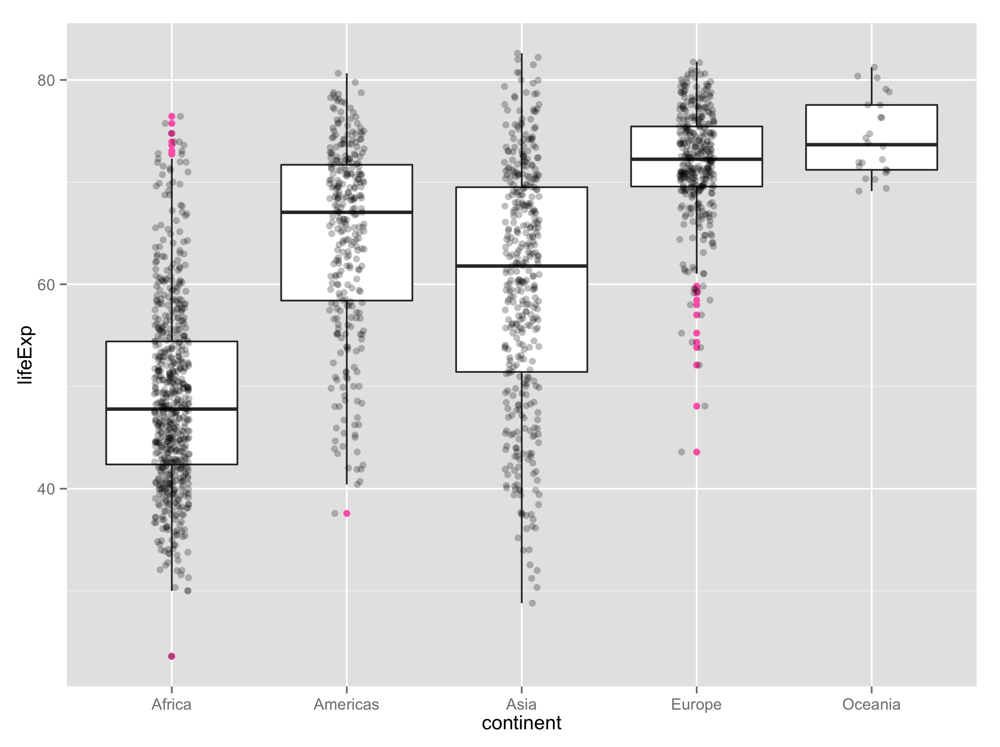

gapminder
=========

Excerpt from the Gapminder data, as an R data package and in plain text delimited form.

According to [Gapminder](http://www.gapminder.org/data/), this data can be reused freely, but with attribution.

### Install and test drive

```r
library(devtools)
install_github("jennybc/gapminder")

library(gapminder)

aggregate(lifeExp ~ continent, gapminder, median)

library(dplyr)
gapminder %>%
    filter(year == 2007) %>%
    group_by(continent) %>%
    summarise(lifeExp = median(lifeExp))
    
library(ggplot2)
ggplot(gapminder, aes(x = continent, y = lifeExp)) +
  geom_boxplot(outlier.colour = "hotpink") +
  geom_jitter(position = position_jitter(width = 0.1, height = 0), alpha = 1/4)
```



### Description of the dataset

I have used this excerpt in [STAT 545](http://stat545-ubc.github.io) since 2008 and, more recently, in [R-flavored Software Carpentry Workshops](http://jennybc.github.io/2014-05-12-ubc/). I've been amazed at how useful and durable this dataset is for teaching data analysis with R.

Description:

  * 1704 observations; fills a size niche between `iris` (150 rows) and the likes of `diamonds` (54K rows)
  * 6 variables
    - `country` a factor with 142 levels
    - `continent`, a factor with 5 levels
    - `year`: going from 1952 to 2007 in increments of 5 years
    - `pop`: population
    - `gdpPercap`: GDP per capita
    - `lifeExp`: life expectancy

There are 12 rows for each country, i.e. complete data for 1952, 1955, ..., 2007.

The two factors provide opportunities to demonstrate factor handling, in aggregation and visualization, for factors with very few and very many levels.

The four quantitative variables are generally quite correlated with each other and these trends have interesting relationships to `country` and `continent`, so you will find that simple plots and aggregations tell a reasonable story and are not completely boring.

Visualization of the temporal trends in life expectancy, by country, is particularly rewarding, since there are several countries with sharp drops due to political upheaval. This then motivates more systematic investigations via data aggregation to proactively identify all countries whose data exhibits certain properties.

### Cleaning

<blockquote class="twitter-tweet" lang="en"><p>Data cleaning code cannot be clean. It&#39;s a sort of sin eater.</p>&mdash; Stat Fact (@StatFact) <a href="https://twitter.com/StatFact/status/492753200190341120">July 25, 2014</a></blockquote>

The [`data-raw`](data-raw) directory contains all of the scripts used to extract the data from the Excel spreadsheets downloaded from [Gapminder](http://www.gapminder.org) in 2008 and 2009. All underlying and intermediate data is there as well, going back to the Excel files themselves.

I explicitly use this package to teach data cleaning, so have refactored my old cleaning code into several scripts and also include compiled Markdown reports *(no Markdown yet; see [iss#1](https://github.com/jennybc/gapminder/issues/1))*. In hindsight, I wouldn't necessarily clean it the same way again (and I would download more recent data!), but at this point there is great value in reproducing the data I've been using for ~5 years.

### Plain text delimited files

The same dataset available via `library(gapminder); gapminder` is also provided as [`gapminder.tsv`](inst/gapminder.tsv). A larger dataset is available as [`gapminder-unfiltered.tsv`](inst/gapminder-unfiltered.tsv). This differs from the former in that I did not filter for the years 1952, 1957, ..., 2007 and I did not create data for China in 1952, i.e. it's less balanced. The main package dataset, which has data for 12 years for each country, has 1704 rows, whereas the larger, unfiltered dataset contains 3312 rows, almost twice as much data.
