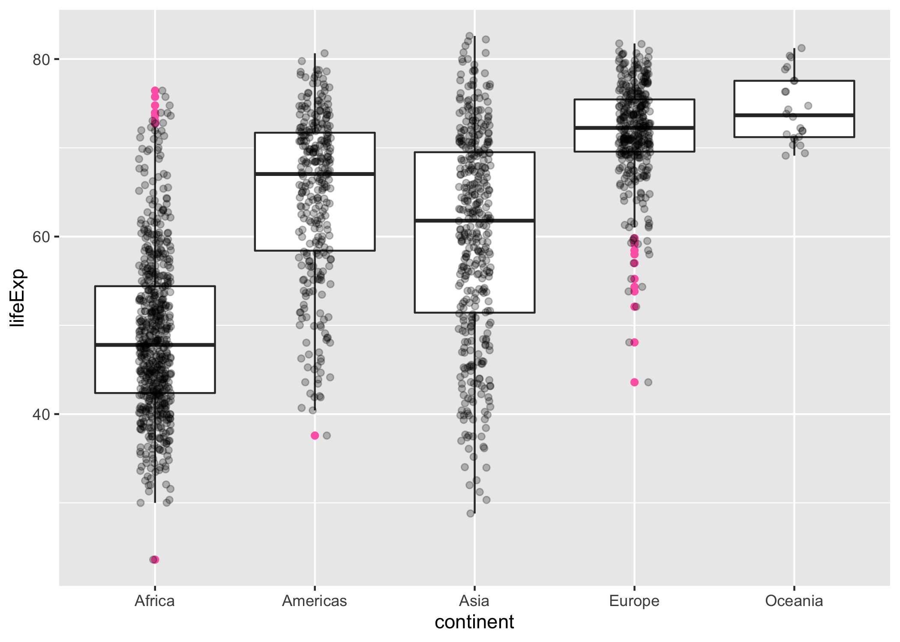

<!-- README.md is generated from README.Rmd. Please edit that file -->

# gapminder

<!-- badges: start -->

[](https://doi.org/10.5281/zenodo.594018)
[](https://CRAN.R-project.org/package=gapminder)

[](https://github.com/jennybc/gapminder/actions/workflows/R-CMD-check.yaml)
<!-- badges: end -->

This repo is a data package with an excerpt from the
[Gapminder](https://www.gapminder.org/data/) data. The main object in
this package is the `gapminder` data frame or “tibble”. There are other
goodies, such as the data in tab delimited form, a larger unfiltered
dataset, premade color schemes for the countries and continents, and ISO
3166-1 country codes. The primary use case is for teaching and writing
examples.

## Installation

Install `gapminder` from CRAN:

``` r
install.packages("gapminder")
```

## Quick look

Here we do a bit of data aggregation and plotting with the `gapminder`
data:

``` r
library(gapminder)
library(dplyr)
library(ggplot2)

aggregate(lifeExp ~ continent, gapminder, median)
#>   continent lifeExp
#> 1    Africa 47.7920
#> 2  Americas 67.0480
#> 3      Asia 61.7915
#> 4    Europe 72.2410
#> 5   Oceania 73.6650

gapminder %>%
  filter(year == 2007) %>%
  group_by(continent) %>%
  summarise(lifeExp = median(lifeExp))
#> # A tibble: 5 × 2
#>   continent lifeExp
#>   <fct>       <dbl>
#> 1 Africa       52.9
#> 2 Americas     72.9
#> 3 Asia         72.4
#> 4 Europe       78.6
#> 5 Oceania      80.7

ggplot(gapminder, aes(x = continent, y = lifeExp)) +
  geom_boxplot(outlier.colour = "hotpink") +
  geom_jitter(position = position_jitter(width = 0.1, height = 0), alpha = 1 / 4)
```



For more, see the [Get
started](https://jennybc.github.io/gapminder/articles/gapminder.html)
vignette.
