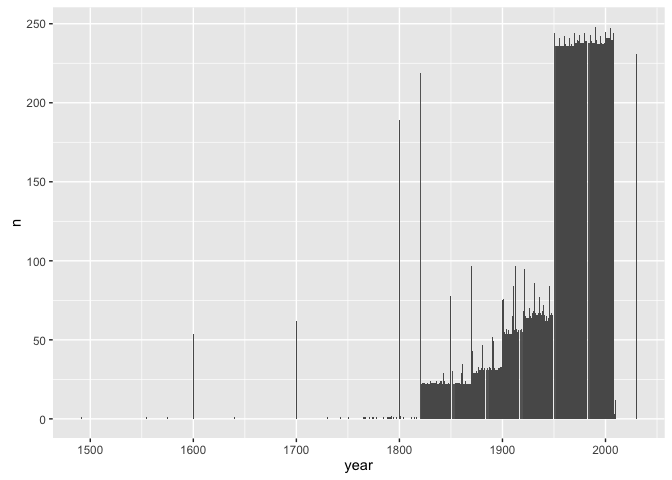
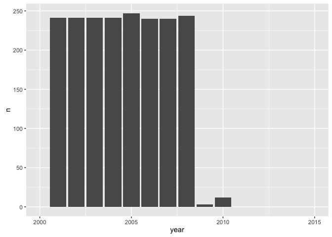

`r format(Sys.Date())`  
Cleaning history

* 2010: The first time I documented cleaning this dataset. I started with
delimited files I exported from Excel.
* 2014: I re-cleaned the data and (mostly) forced myself to pull it straight
out of the spreadsheets. Used the gdata package.
* 2015: I revisited the cleaning and switched to the readxl and readr
packages.


```r
library(readxl)
suppressPackageStartupMessages(library(dplyr))
library(ggplot2)
library(readr)
```

Extract the population data from the Excel file downloaded 2008-10-08 from
gapminder.org


```r
pop_xls <- read_excel("xls/gapdata003.xls")
```

```
## DEFINEDNAME: 21 00 00 01 0b 00 00 00 01 00 00 00 00 00 00 0d 3b 00 00 00 00 e7 4f 00 00 19 00 
## DEFINEDNAME: 21 00 00 01 0b 00 00 00 01 00 00 00 00 00 00 0d 3b 00 00 00 00 e7 4f 00 00 19 00 
## DEFINEDNAME: 21 00 00 01 0b 00 00 00 01 00 00 00 00 00 00 0d 3b 00 00 00 00 e7 4f 00 00 19 00 
## DEFINEDNAME: 21 00 00 01 0b 00 00 00 01 00 00 00 00 00 00 0d 3b 00 00 00 00 e7 4f 00 00 19 00
```

```r
## the DEFINEDNAME thing is described here
## https://github.com/hadley/readxl/issues/82#issuecomment-166767220
## also hiding a crapton of warnings due to variables seeming to be ... numeric
## and then having text in them --> ignore because I drop those variables

pop_xls %>% str()
```

```
## Classes 'tbl_df', 'tbl' and 'data.frame':	20455 obs. of  10 variables:
##  $ Area                 : chr  "Afghanistan" "Afghanistan" "Afghanistan" "Afghanistan" ...
##  $ Year                 : num  1800 1820 1870 1913 1950 ...
##  $ Population           : num  3280000 3280000 4207000 5730000 8150368 ...
##  $ Data quality rating  : num  5 NA NA NA NA NA NA NA NA NA ...
##  $ Data quality         : chr  "Very poor" "NA" "NA" "NA" ...
##  $ Type of primary data : chr  "Arbitrary guess" "NA" "NA" "NA" ...
##  $ Data footnote        : num  NA NA NA NA NA NA NA NA NA NA ...
##  $ Modifications        : chr  NA "NA" "NA" "NA" ...
##  $ Modification footnote: chr  NA NA NA NA ...
##  $ Source of gapminder  : chr  "No data" "Maddison on-line" "Maddison on-line" "Maddison on-line" ...
```

```r
## 2015: 20455 obs. of  10 variables
## 2014: 20455 obs. of  12 variables
## 2010: 22903 obs. of  10 variables
pop_xls %>% head()
```

```
## Source: local data frame [6 x 10]
## 
##          Area  Year Population Data quality rating Data quality
##         (chr) (dbl)      (dbl)               (dbl)        (chr)
## 1 Afghanistan  1800    3280000                   5    Very poor
## 2 Afghanistan  1820    3280000                  NA           NA
## 3 Afghanistan  1870    4207000                  NA           NA
## 4 Afghanistan  1913    5730000                  NA           NA
## 5 Afghanistan  1950    8150368                  NA           NA
## 6 Afghanistan  1951    8284473                  NA           NA
## Variables not shown: Type of primary data (chr), Data footnote (dbl),
##   Modifications (chr), Modification footnote (chr), Source of gapminder
##   (chr).
```

Get rid of vars I will not use; rename vars I keep.


```r
pop_raw <- pop_xls %>%
  select(country = Area, year = Year, pop = Population)
pop_raw %>% str()
```

```
## Classes 'tbl_df', 'tbl' and 'data.frame':	20455 obs. of  3 variables:
##  $ country: chr  "Afghanistan" "Afghanistan" "Afghanistan" "Afghanistan" ...
##  $ year   : num  1800 1820 1870 1913 1950 ...
##  $ pop    : num  3280000 3280000 4207000 5730000 8150368 ...
```

Focus on the years where most of the data is.


```r
summary(pop_raw$year)
```

```
##    Min. 1st Qu.  Median    Mean 3rd Qu.    Max. 
##    1491    1935    1967    1953    1988    2030
```

AHA! In 2010, this also included 2448 NA's. 20455 + 2448 = 22903. Mystery of
the rows solved.


```r
year_freq <- pop_raw %>%
  count(year)

(p <- ggplot(year_freq, aes(x = year, y = n)) +
  geom_bar(stat = "identity"))
```

\ 

```r
p + xlim(c(1800, 2010))
```

```
## Warning: Removed 25 rows containing missing values (position_stack).
```

\ 

```r
p + xlim(c(1945, 1955)) # huge increase at 1950
```

```
## Warning: Removed 211 rows containing missing values (position_stack).
```

\ 

```r
p + xlim(c(2000, 2015)) # huge drop at 2009 (data contains some extrapolation)
```

```
## Warning: Removed 211 rows containing missing values (position_stack).
```

\ 

Keep data from 1950 to 2008


```r
year_min <- 1950
year_max <- 2008
pop_raw <- pop_raw %>%
  filter(year %>% between(year_min, year_max))
str(pop_raw)
```

```
## Classes 'tbl_df', 'tbl' and 'data.frame':	14105 obs. of  3 variables:
##  $ country: chr  "Afghanistan" "Afghanistan" "Afghanistan" "Afghanistan" ...
##  $ year   : num  1950 1951 1952 1953 1954 ...
##  $ pop    : num  8150368 8284473 8425333 8573217 8728408 ...
```

I am the voice from the future: look at India!


```r
pop_raw %>% 
  filter(country == "India")
```

```
## Source: local data frame [59 x 3]
## 
##    country  year      pop
##      (chr) (dbl)    (dbl)
## 1    India  1950 3.59e+08
## 2    India  1951 3.65e+08
## 3    India  1952 3.72e+08
## 4    India  1953 3.79e+08
## 5    India  1954 3.86e+08
## 6    India  1955 3.93e+08
## 7    India  1956 4.01e+08
## 8    India  1957 4.09e+08
## 9    India  1958 4.18e+08
## 10   India  1959 4.26e+08
## ..     ...   ...      ...
```

These doubles create problems later. GET RID OF THEM NOW.
Force the population to be integer.


```r
pop_raw <- pop_raw %>% 
  mutate(pop = pop %>% as.integer())
```

Save for now


```r
write_tsv(pop_raw, "01_pop.tsv")

devtools::session_info()
```

```
## Session info --------------------------------------------------------------
```

```
##  setting  value                       
##  version  R version 3.2.3 (2015-12-10)
##  system   x86_64, darwin13.4.0        
##  ui       X11                         
##  language (EN)                        
##  collate  en_CA.UTF-8                 
##  tz       America/Vancouver           
##  date     2015-12-29
```

```
## Packages ------------------------------------------------------------------
```

```
##  package    * version    date       source                          
##  assertthat   0.1        2013-12-06 CRAN (R 3.2.0)                  
##  colorspace   1.2-6      2015-03-11 CRAN (R 3.2.0)                  
##  DBI          0.3.1      2014-09-24 CRAN (R 3.2.0)                  
##  devtools     1.9.1.9000 2015-12-18 Github (hadley/devtools@9aaa3af)
##  digest       0.6.8      2014-12-31 CRAN (R 3.2.0)                  
##  dplyr      * 0.4.3.9000 2015-11-24 Github (hadley/dplyr@4f2d7f8)   
##  evaluate     0.8        2015-09-18 CRAN (R 3.2.0)                  
##  formatR      1.2.1      2015-09-18 CRAN (R 3.2.0)                  
##  ggplot2    * 2.0.0      2015-12-18 CRAN (R 3.2.3)                  
##  gtable       0.1.2      2012-12-05 CRAN (R 3.2.0)                  
##  htmltools    0.2.6      2014-09-08 CRAN (R 3.2.0)                  
##  knitr        1.11.16    2015-11-23 Github (yihui/knitr@6e8ce0c)    
##  labeling     0.3        2014-08-23 CRAN (R 3.2.0)                  
##  lazyeval     0.1.10     2015-01-02 CRAN (R 3.2.0)                  
##  magrittr     1.5        2014-11-22 CRAN (R 3.2.0)                  
##  memoise      0.2.1      2014-04-22 CRAN (R 3.2.0)                  
##  munsell      0.4.2      2013-07-11 CRAN (R 3.2.0)                  
##  plyr         1.8.3      2015-06-12 CRAN (R 3.2.0)                  
##  R6           2.1.1      2015-08-19 CRAN (R 3.2.0)                  
##  Rcpp         0.12.2     2015-11-15 CRAN (R 3.2.2)                  
##  readr      * 0.2.2      2015-10-22 CRAN (R 3.2.0)                  
##  readxl     * 0.1.0      2015-04-14 CRAN (R 3.2.0)                  
##  rmarkdown    0.9        2015-12-22 CRAN (R 3.2.3)                  
##  scales       0.3.0      2015-08-25 CRAN (R 3.2.0)                  
##  stringi      1.0-1      2015-10-22 CRAN (R 3.2.0)                  
##  stringr      1.0.0      2015-04-30 CRAN (R 3.2.0)                  
##  yaml         2.1.13     2014-06-12 CRAN (R 3.2.0)
```


---
title: "01_extract-from-excel-pop.R"
author: "jenny"
date: "Tue Dec 29 21:51:43 2015"
---
