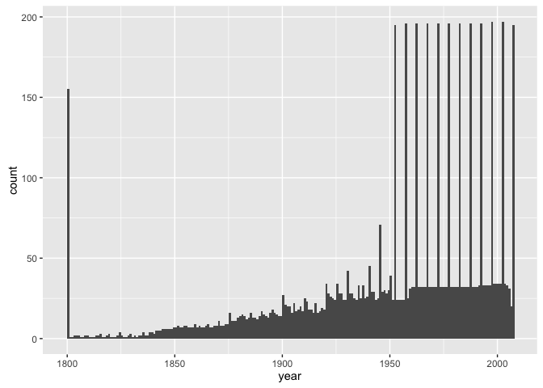
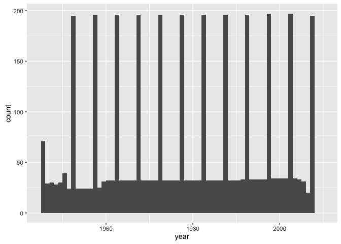
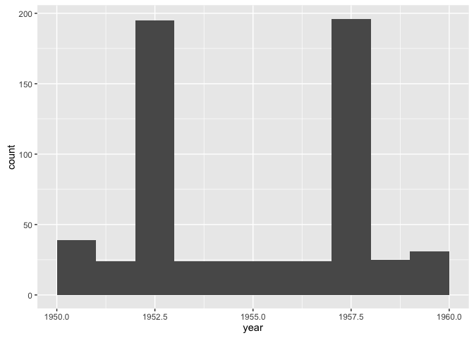
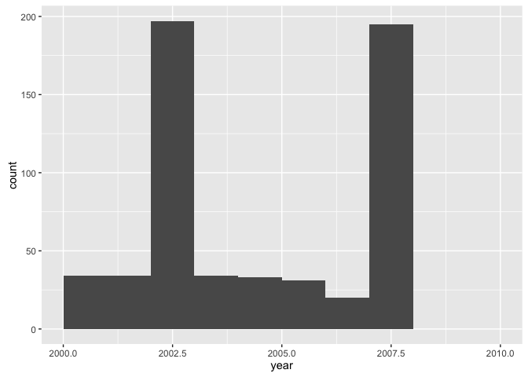

`r format(Sys.Date())`  
Cleaning history

* 2010: The first time I documented cleaning this dataset. I started with
delimited files I exported from Excel.
* 2014: I re-cleaned the data and (mostly) forced myself to pull it straight
out of the spreadsheets. Used the gdata package.
* 2015: I revisited the cleaning and switched to the readxl and readr
packages.


```r
library(readxl)
suppressPackageStartupMessages(library(dplyr))
library(ggplot2)
library(readr)
```

Extract the life expectancy data from the Excel file downloaded 2009-04-21
from gapminder.org.


```r
le_xls <-
  read_excel("xls/life-expectancy-reference-spreadsheet-20090204-xls-format.xls",
             sheet = "Data and metadata")
```

```
## DEFINEDNAME: 21 00 00 01 0b 00 00 00 04 00 00 00 00 00 00 0d 3b 00 00 00 00 c0 cc 00 00 08 00 
## DEFINEDNAME: 21 00 00 01 0b 00 00 00 04 00 00 00 00 00 00 0d 3b 00 00 00 00 c0 cc 00 00 08 00 
## DEFINEDNAME: 21 00 00 01 0b 00 00 00 04 00 00 00 00 00 00 0d 3b 00 00 00 00 c0 cc 00 00 08 00 
## DEFINEDNAME: 21 00 00 01 0b 00 00 00 04 00 00 00 00 00 00 0d 3b 00 00 00 00 c0 cc 00 00 08 00 
## DEFINEDNAME: 21 00 00 01 0b 00 00 00 04 00 00 00 00 00 00 0d 3b 00 00 00 00 c0 cc 00 00 08 00
```

```r
## the DEFINEDNAME thing is described here
## https://github.com/hadley/readxl/issues/82#issuecomment-166767220
## I am hiding a crapton of warnings

le_xls %>% str()
```

```
## Classes 'tbl_df', 'tbl' and 'data.frame':	52416 obs. of  9 variables:
##  $ Continent average used (see documentation)                                                    : chr  "Asia" "Asia" "Asia" "Asia" ...
##  $ Country                                                                                       : chr  "Abkhazia" "Abkhazia" "Abkhazia" "Abkhazia" ...
##  $ Year                                                                                          : num  1800 1801 1802 1803 1804 ...
##  $ Life expectancy at birth (including Gapminder model - not to be used for statistical analysis): num  NA NA NA NA NA NA NA NA NA NA ...
##  $ Our source                                                                                    : num  NA NA NA NA NA NA NA NA NA NA ...
##  $ Note on the timing of health transition                                                       : num  NA NA NA NA NA NA NA NA NA NA ...
##  $ Other notes                                                                                   : num  NA NA NA NA NA NA NA NA NA NA ...
##  $ Source II (where our source found their estimate)                                             : num  NA NA NA NA NA NA NA NA NA NA ...
##  $ Quality of estimate (5 = very poor; 1 = very good)                                            : num  NA NA NA NA NA NA NA NA NA NA ...
```

Select and rename vars.


```r
le_raw <- le_xls %>%
  select(country = contains("country"), continent = contains("continent"),
         year = contains("year"), lifeExp = contains("expectancy"))
le_raw %>% str()
```

```
## Classes 'tbl_df', 'tbl' and 'data.frame':	52416 obs. of  4 variables:
##  $ country  : chr  "Abkhazia" "Abkhazia" "Abkhazia" "Abkhazia" ...
##  $ continent: chr  "Asia" "Asia" "Asia" "Asia" ...
##  $ year     : num  1800 1801 1802 1803 1804 ...
##  $ lifeExp  : num  NA NA NA NA NA NA NA NA NA NA ...
```

```r
## 2015: 52416 obs. of 4 variables
## 2014: 52419 obs. of 4 variables
## 2010: 52416 obs. of 9 variables <-- wtf?
le_raw %>% head()
```

```
## Source: local data frame [6 x 4]
## 
##    country continent  year lifeExp
##      (chr)     (chr) (dbl)   (dbl)
## 1 Abkhazia      Asia  1800      NA
## 2 Abkhazia      Asia  1801      NA
## 3 Abkhazia      Asia  1802      NA
## 4 Abkhazia      Asia  1803      NA
## 5 Abkhazia      Asia  1804      NA
## 6 Abkhazia      Asia  1805      NA
```

```r
le_raw %>% tail()
```

```
## Source: local data frame [6 x 4]
## 
##   country continent  year lifeExp
##     (chr)     (chr) (dbl)   (dbl)
## 1   Åland    Europe  2002   81.80
## 2   Åland    Europe  2003   80.63
## 3   Åland    Europe  2004   79.88
## 4   Åland    Europe  2005   80.00
## 5   Åland    Europe  2006   80.10
## 6   Åland    Europe  2007      NA
```

Let's look at `year`.


```r
n_distinct(le_raw$year)
```

```
## [1] 208
```

```r
## 210 unique values in 2014 cleaning
unique(le_raw$year)
```

```
##   [1] 1800 1801 1802 1803 1804 1805 1806 1807 1808 1809 1810 1811 1812 1813
##  [15] 1814 1815 1816 1817 1818 1819 1820 1821 1822 1823 1824 1825 1826 1827
##  [29] 1828 1829 1830 1831 1832 1833 1834 1835 1836 1837 1838 1839 1840 1841
##  [43] 1842 1843 1844 1845 1846 1847 1848 1849 1850 1851 1852 1853 1854 1855
##  [57] 1856 1857 1858 1859 1860 1861 1862 1863 1864 1865 1866 1867 1868 1869
##  [71] 1870 1871 1872 1873 1874 1875 1876 1877 1878 1879 1880 1881 1882 1883
##  [85] 1884 1885 1886 1887 1888 1889 1890 1891 1892 1893 1894 1895 1896 1897
##  [99] 1898 1899 1900 1901 1902 1903 1904 1905 1906 1907 1908 1909 1910 1911
## [113] 1912 1913 1914 1915 1916 1917 1918 1919 1920 1921 1922 1923 1924 1925
## [127] 1926 1927 1928 1929 1930 1931 1932 1933 1934 1935 1936 1937 1938 1939
## [141] 1940 1941 1942 1943 1944 1945 1946 1947 1948 1949 1950 1951 1952 1953
## [155] 1954 1955 1956 1957 1958 1959 1960 1961 1962 1963 1964 1965 1966 1967
## [169] 1968 1969 1970 1971 1972 1973 1974 1975 1976 1977 1978 1979 1980 1981
## [183] 1982 1983 1984 1985 1986 1987 1988 1989 1990 1991 1992 1993 1994 1995
## [197] 1996 1997 1998 1999 2000 2001 2002 2003 2004 2005 2006 2007
```

Eye-ball-o-metric inspection suggests these might all be integers between
1800 and 2007. True?


```r
all(le_raw$year %in% 1800:2007)
```

```
## [1] TRUE
```

Great. Convert year to integer.


```r
le_raw <- le_raw %>%
  mutate(year = year %>% as.integer())

le_raw$year %>% summary()
```

```
##    Min. 1st Qu.  Median    Mean 3rd Qu.    Max. 
##    1800    1852    1904    1904    1955    2007
```

Sidebar: In 2014, there were 3 NA's. Perhaps they derived from some
diabolically hidden rows in the Excel file. In Excel, mere 'unhide' does NOT
reveal these rows. If you look carefully, you can see missing row numbers. To
reveal the rows, use 'unset filters'. Regardless, these rows aren't picked up
in 2010 or 2015 and get filtered out no matter what.

Let's look at `lifeExp`.


```r
le_raw$lifeExp %>% head(100)
```

```
##   [1] NA NA NA NA NA NA NA NA NA NA NA NA NA NA NA NA NA NA NA NA NA NA NA
##  [24] NA NA NA NA NA NA NA NA NA NA NA NA NA NA NA NA NA NA NA NA NA NA NA
##  [47] NA NA NA NA NA NA NA NA NA NA NA NA NA NA NA NA NA NA NA NA NA NA NA
##  [70] NA NA NA NA NA NA NA NA NA NA NA NA NA NA NA NA NA NA NA NA NA NA NA
##  [93] NA NA NA NA NA NA NA NA
```

How many `NA`s are there ?!?


```r
sum(is.na(le_raw$lifeExp))
```

```
## [1] 46507
```

Drop them.


```r
le_raw <- le_raw %>%
  filter(!is.na(lifeExp))
str(le_raw)
```

```
## Classes 'tbl_df', 'tbl' and 'data.frame':	5909 obs. of  4 variables:
##  $ country  : chr  "Afghanistan" "Afghanistan" "Afghanistan" "Afghanistan" ...
##  $ continent: chr  "Asia" "Asia" "Asia" "Asia" ...
##  $ year     : int  1800 1952 1957 1962 1967 1972 1977 1982 1987 1992 ...
##  $ lifeExp  : num  28.8 28.8 30.3 32 34 ...
```

```r
le_raw$lifeExp %>% summary()
```

```
##    Min. 1st Qu.  Median    Mean 3rd Qu.    Max. 
##   11.60   45.21   61.17   58.02   70.90   82.67
```

Is `continent` ok as is?


```r
n_distinct(le_raw$continent) # 7
```

```
## [1] 7
```

```r
unique(le_raw$continent)
```

```
## [1] "Asia"     "Europe"   "Africa"   "Americas" NA         "FSU"     
## [7] "Oceania"
```

Let's look further into empty continent and the novel continent FSU.


```r
(empty_continent <- le_raw %>%
   filter(is.na(continent)) %>%
   select(country) %>%
   unique())
```

```
## Source: local data frame [30 x 1]
## 
##             country
##               (chr)
## 1           Armenia
## 2             Aruba
## 3         Australia
## 4      Bahamas, The
## 5          Barbados
## 6            Belize
## 7            Canada
## 8     French Guiana
## 9  French Polynesia
## 10          Georgia
## ..              ...
```

```r
str(empty_continent)
```

```
## Classes 'tbl_df' and 'data.frame':	30 obs. of  1 variable:
##  $ country: chr  "Armenia" "Aruba" "Australia" "Bahamas, The" ...
```

Wait to fix these after merging pop + lifeExp + gdpPercap.


```r
(fsu_continent <- le_raw %>%
   filter(continent == "FSU") %>%
   select(country) %>%
   unique())
```

```
## Source: local data frame [6 x 1]
## 
##              country
##                (chr)
## 1            Belarus
## 2         Kazakhstan
## 3             Latvia
## 4          Lithuania
## 5 Russian Federation
## 6            Ukraine
```

Aha. Former Soviet Union. Handle this after merge.

Is `country` ok as is?


```r
n_distinct(le_raw$country) # 198
```

```
## [1] 198
```

```r
unique(le_raw$country)
```

```
##   [1] "Afghanistan"                    "Albania"                       
##   [3] "Algeria"                        "Angola"                        
##   [5] "Argentina"                      "Armenia"                       
##   [7] "Aruba"                          "Australia"                     
##   [9] "Austria"                        "Azerbaijan"                    
##  [11] "Bahamas, The"                   "Bahrain"                       
##  [13] "Bangladesh"                     "Barbados"                      
##  [15] "Belarus"                        "Belgium"                       
##  [17] "Belize"                         "Benin"                         
##  [19] "Bhutan"                         "Bolivia"                       
##  [21] "Bosnia and Herzegovina"         "Botswana"                      
##  [23] "Brazil"                         "Brunei"                        
##  [25] "Bulgaria"                       "Burkina Faso"                  
##  [27] "Burundi"                        "Cambodia"                      
##  [29] "Cameroon"                       "Canada"                        
##  [31] "Cape Verde"                     "Central African Republic"      
##  [33] "Chad"                           "Channel Islands"               
##  [35] "Chile"                          "China"                         
##  [37] "Colombia"                       "Comoros"                       
##  [39] "Congo, Dem. Rep."               "Congo, Rep."                   
##  [41] "Costa Rica"                     "Cote d'Ivoire"                 
##  [43] "Croatia"                        "Cuba"                          
##  [45] "Cyprus"                         "Czech Republic"                
##  [47] "Denmark"                        "Djibouti"                      
##  [49] "Dominican Republic"             "Ecuador"                       
##  [51] "Egypt, Arab Rep."               "El Salvador"                   
##  [53] "Equatorial Guinea"              "Eritrea"                       
##  [55] "Estonia"                        "Ethiopia"                      
##  [57] "Fiji"                           "Finland"                       
##  [59] "France"                         "French Guiana"                 
##  [61] "French Polynesia"               "Gabon"                         
##  [63] "Gambia, The"                    "Georgia"                       
##  [65] "Germany"                        "Ghana"                         
##  [67] "Greece"                         "Grenada"                       
##  [69] "Guadeloupe"                     "Guam"                          
##  [71] "Guatemala"                      "Guinea"                        
##  [73] "Guinea-Bissau"                  "Guyana"                        
##  [75] "Haiti"                          "Honduras"                      
##  [77] "Hong Kong, China"               "Hungary"                       
##  [79] "Iceland"                        "India"                         
##  [81] "Indonesia"                      "Iran, Islamic Rep."            
##  [83] "Iraq"                           "Ireland"                       
##  [85] "Israel"                         "Italy"                         
##  [87] "Jamaica"                        "Japan"                         
##  [89] "Jordan"                         "Kazakhstan"                    
##  [91] "Kenya"                          "Korea, Dem. Rep."              
##  [93] "Korea, Rep."                    "Kuwait"                        
##  [95] "Kyrgyz Republic"                "Lao PDR"                       
##  [97] "Latvia"                         "Lebanon"                       
##  [99] "Lesotho"                        "Liberia"                       
## [101] "Libya"                          "Lithuania"                     
## [103] "Luxembourg"                     "Macao, China"                  
## [105] "Madagascar"                     "Malawi"                        
## [107] "Malaysia"                       "Maldives"                      
## [109] "Mali"                           "Malta"                         
## [111] "Martinique"                     "Mauritania"                    
## [113] "Mauritius"                      "Mexico"                        
## [115] "Micronesia, Fed. Sts."          "Moldova"                       
## [117] "Mongolia"                       "Montenegro"                    
## [119] "Morocco"                        "Mozambique"                    
## [121] "Myanmar"                        "Namibia"                       
## [123] "Nepal"                          "Netherlands"                   
## [125] "Netherlands Antilles"           "New Caledonia"                 
## [127] "New Zealand"                    "Nicaragua"                     
## [129] "Niger"                          "Nigeria"                       
## [131] "Norway"                         "Oman"                          
## [133] "Pakistan"                       "Panama"                        
## [135] "Papua New Guinea"               "Paraguay"                      
## [137] "Peru"                           "Philippines"                   
## [139] "Poland"                         "Portugal"                      
## [141] "Puerto Rico"                    "Qatar"                         
## [143] "Reunion"                        "Romania"                       
## [145] "Russian Federation"             "Rwanda"                        
## [147] "Samoa"                          "Sao Tome and Principe"         
## [149] "Saudi Arabia"                   "Senegal"                       
## [151] "Serbia"                         "Sierra Leone"                  
## [153] "Singapore"                      "Slovak Republic"               
## [155] "Slovenia"                       "Solomon Islands"               
## [157] "Somalia"                        "South Africa"                  
## [159] "Spain"                          "Sri Lanka"                     
## [161] "St. Lucia"                      "St. Vincent and the Grenadines"
## [163] "Sudan"                          "Suriname"                      
## [165] "Swaziland"                      "Sweden"                        
## [167] "Switzerland"                    "Syrian Arab Republic"          
## [169] "Taiwan"                         "Tajikistan"                    
## [171] "Tanzania"                       "Thailand"                      
## [173] "Timor-Leste"                    "Togo"                          
## [175] "Tokelau"                        "Tonga"                         
## [177] "Trinidad and Tobago"            "Tunisia"                       
## [179] "Turkey"                         "Turkmenistan"                  
## [181] "Uganda"                         "Ukraine"                       
## [183] "United Arab Emirates"           "United Kingdom"                
## [185] "United States"                  "Uruguay"                       
## [187] "Uzbekistan"                     "Vanuatu"                       
## [189] "Venezuela, RB"                  "West Bank and Gaza"            
## [191] "Western Sahara"                 "Vietnam"                       
## [193] "Virgin Islands (U.S.)"          "Yemen, Rep."                   
## [195] "Yugoslavia"                     "Zambia"                        
## [197] "Zimbabwe"                       "Åland"
```

No obvious train wrecks.
Return to year.


```r
n_distinct(le_raw$year)
```

```
## [1] 208
```

```r
(p <- ggplot(le_raw, aes(x = year)) + geom_histogram(binwidth = 1))
```

\ 

```r
p + xlim(c(1945, 2010))
```

```
## Warning: Removed 1935 rows containing non-finite values (stat_bin).
```

```
## Warning: Removed 2 rows containing missing values (geom_bar).
```

\ 

```r
p + xlim(c(1950, 1960))
```

```
## Warning: Removed 5271 rows containing non-finite values (stat_bin).
```

```
## Warning: Removed 2 rows containing missing values (geom_bar).
```

\ 

```r
p + xlim(c(2000, 2010))
```

```
## Warning: Removed 5331 rows containing non-finite values (stat_bin).
```

```
## Warning: Removed 2 rows containing missing values (geom_bar).
```

\ 

I see spikes every five years after 1950.
Keep data from 1950 to 2007.


```r
year_min <- 1950
year_max <- 2007
le_raw <- le_raw %>%
  filter(year %>% between(year_min, year_max))
le_raw %>% str()
```

```
## Classes 'tbl_df', 'tbl' and 'data.frame':	3786 obs. of  4 variables:
##  $ country  : chr  "Afghanistan" "Afghanistan" "Afghanistan" "Afghanistan" ...
##  $ continent: chr  "Asia" "Asia" "Asia" "Asia" ...
##  $ year     : int  1952 1957 1962 1967 1972 1977 1982 1987 1992 1997 ...
##  $ lifeExp  : num  28.8 30.3 32 34 36.1 ...
```

Restore variable order from previous cleaning runs to minimize silly diffs.


```r
le_raw <- le_raw %>% 
  select(country, continent, year, lifeExp)
```

Save for now


```r
write_tsv(le_raw, "02_lifeExp.tsv")

devtools::session_info()
```

```
## Session info --------------------------------------------------------------
```

```
##  setting  value                       
##  version  R version 3.2.3 (2015-12-10)
##  system   x86_64, darwin13.4.0        
##  ui       X11                         
##  language (EN)                        
##  collate  en_CA.UTF-8                 
##  tz       America/Vancouver           
##  date     2015-12-29
```

```
## Packages ------------------------------------------------------------------
```

```
##  package    * version    date       source                          
##  assertthat   0.1        2013-12-06 CRAN (R 3.2.0)                  
##  colorspace   1.2-6      2015-03-11 CRAN (R 3.2.0)                  
##  DBI          0.3.1      2014-09-24 CRAN (R 3.2.0)                  
##  devtools     1.9.1.9000 2015-12-18 Github (hadley/devtools@9aaa3af)
##  digest       0.6.8      2014-12-31 CRAN (R 3.2.0)                  
##  dplyr      * 0.4.3.9000 2015-11-24 Github (hadley/dplyr@4f2d7f8)   
##  evaluate     0.8        2015-09-18 CRAN (R 3.2.0)                  
##  formatR      1.2.1      2015-09-18 CRAN (R 3.2.0)                  
##  ggplot2    * 2.0.0      2015-12-18 CRAN (R 3.2.3)                  
##  gtable       0.1.2      2012-12-05 CRAN (R 3.2.0)                  
##  htmltools    0.2.6      2014-09-08 CRAN (R 3.2.0)                  
##  knitr        1.11.16    2015-11-23 Github (yihui/knitr@6e8ce0c)    
##  labeling     0.3        2014-08-23 CRAN (R 3.2.0)                  
##  lazyeval     0.1.10     2015-01-02 CRAN (R 3.2.0)                  
##  magrittr     1.5        2014-11-22 CRAN (R 3.2.0)                  
##  memoise      0.2.1      2014-04-22 CRAN (R 3.2.0)                  
##  munsell      0.4.2      2013-07-11 CRAN (R 3.2.0)                  
##  plyr         1.8.3      2015-06-12 CRAN (R 3.2.0)                  
##  R6           2.1.1      2015-08-19 CRAN (R 3.2.0)                  
##  Rcpp         0.12.2     2015-11-15 CRAN (R 3.2.2)                  
##  readr      * 0.2.2      2015-10-22 CRAN (R 3.2.0)                  
##  readxl     * 0.1.0      2015-04-14 CRAN (R 3.2.0)                  
##  rmarkdown    0.9        2015-12-22 CRAN (R 3.2.3)                  
##  scales       0.3.0      2015-08-25 CRAN (R 3.2.0)                  
##  stringi      1.0-1      2015-10-22 CRAN (R 3.2.0)                  
##  stringr      1.0.0      2015-04-30 CRAN (R 3.2.0)                  
##  yaml         2.1.13     2014-06-12 CRAN (R 3.2.0)
```


---
title: "02_extract-from-excel-lifeExp.R"
author: "jenny"
date: "Tue Dec 29 21:51:35 2015"
---
