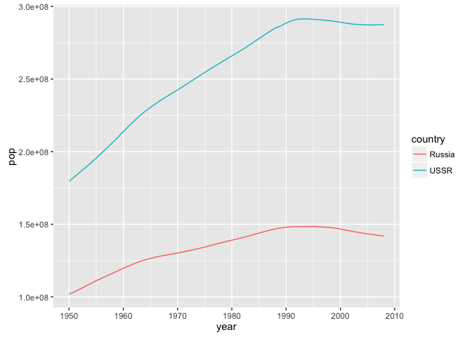

`r format(Sys.Date())`  


```r
library(plyr)  ## revalue()
suppressPackageStartupMessages(library(dplyr))
library(ggplot2)
library(readr)
```

Bring in lightly cleaned datasets extracted from Excel spreadsheets.


```r
pop_dat <- read_tsv("01_pop.tsv") %>% 
  mutate(country = factor(country))
pop_dat %>% str()
```

```
## Classes 'tbl_df', 'tbl' and 'data.frame':	14105 obs. of  3 variables:
##  $ country: Factor w/ 253 levels "Afghanistan",..: 1 1 1 1 1 1 1 1 1 1 ...
##  $ year   : int  1950 1951 1952 1953 1954 1955 1956 1957 1958 1959 ...
##  $ pop    : int  8150368 8284473 8425333 8573217 8728408 8891209 9061938 9240934 9428556 9624606 ...
```

```r
pop_dat %>% head()
```

```
## Source: local data frame [6 x 3]
## 
##       country  year     pop
##        (fctr) (int)   (int)
## 1 Afghanistan  1950 8150368
## 2 Afghanistan  1951 8284473
## 3 Afghanistan  1952 8425333
## 4 Afghanistan  1953 8573217
## 5 Afghanistan  1954 8728408
## 6 Afghanistan  1955 8891209
```

```r
pop_dat %>% tail()
```

```
## Source: local data frame [6 x 3]
## 
##   country  year   pop
##    (fctr) (int) (int)
## 1   Åland  2001 26008
## 2   Åland  2002 26257
## 3   Åland  2003 26347
## 4   Åland  2004 26530
## 5   Åland  2005 26766
## 6   Åland  2006 26923
```

```r
le_dat <- read_tsv("02_lifeExp.tsv") %>% 
  mutate(country = factor(country),
         continent = factor(continent))
le_dat %>% str()
```

```
## Classes 'tbl_df', 'tbl' and 'data.frame':	3786 obs. of  4 variables:
##  $ country  : Factor w/ 198 levels "Afghanistan",..: 1 1 1 1 1 1 1 1 1 1 ...
##  $ continent: Factor w/ 6 levels "Africa","Americas",..: 3 3 3 3 3 3 3 3 3 3 ...
##  $ year     : int  1952 1957 1962 1967 1972 1977 1982 1987 1992 1997 ...
##  $ lifeExp  : num  28.8 30.3 32 34 36.1 ...
```

```r
le_dat %>% head()
```

```
## Source: local data frame [6 x 4]
## 
##       country continent  year lifeExp
##        (fctr)    (fctr) (int)   (dbl)
## 1 Afghanistan      Asia  1952  28.801
## 2 Afghanistan      Asia  1957  30.332
## 3 Afghanistan      Asia  1962  31.997
## 4 Afghanistan      Asia  1967  34.020
## 5 Afghanistan      Asia  1972  36.088
## 6 Afghanistan      Asia  1977  38.438
```

```r
le_dat %>% tail()
```

```
## Source: local data frame [6 x 4]
## 
##   country continent  year lifeExp
##    (fctr)    (fctr) (int)   (dbl)
## 1   Åland    Europe  2001   80.83
## 2   Åland    Europe  2002   81.80
## 3   Åland    Europe  2003   80.63
## 4   Åland    Europe  2004   79.88
## 5   Åland    Europe  2005   80.00
## 6   Åland    Europe  2006   80.10
```

```r
gdp_dat <- read_tsv("03_gdpPercap.tsv") %>% 
  mutate(country = factor(country))
gdp_dat %>% str()
```

```
## Classes 'tbl_df', 'tbl' and 'data.frame':	10911 obs. of  3 variables:
##  $ country  : Factor w/ 229 levels "Afghanistan",..: 1 2 3 4 6 9 10 12 13 14 ...
##  $ gdpPercap: num  757 1532 2429 4465 3363 ...
##  $ year     : int  1950 1950 1950 1950 1950 1950 1950 1950 1950 1950 ...
```

```r
gdp_dat %>% head()
```

```
## Source: local data frame [6 x 3]
## 
##          country gdpPercap  year
##           (fctr)     (dbl) (int)
## 1    Afghanistan  757.3188  1950
## 2        Albania 1532.3539  1950
## 3        Algeria 2429.2137  1950
## 4 American Samoa 4465.1447  1950
## 5         Angola 3363.0218  1950
## 6      Argentina 6252.8586  1950
```

```r
gdp_dat %>% tail()
```

```
## Source: local data frame [6 x 3]
## 
##              country  gdpPercap  year
##               (fctr)      (dbl) (int)
## 1          Venezuela 11415.8057  2007
## 2 West Bank and Gaza  3025.3498  2007
## 3            Vietnam  2441.5764  2007
## 4        Yemen, Rep.  2280.7699  2007
## 5             Zambia  1271.2116  2007
## 6           Zimbabwe   469.7093  2007
```

Overlap between countries in the different datasets


```r
country_levels <- function(df) levels(df$country)
union_country <- country_levels(pop_dat) %>%
  union(country_levels(le_dat)) %>%
  union(country_levels(gdp_dat)) %>%
  sort()
union_country %>% length()
```

```
## [1] 271
```

```r
union_country
```

```
##   [1] "Afghanistan"                      "Akrotiri and Dhekelia"           
##   [3] "Åland"                            "Albania"                         
##   [5] "Algeria"                          "American Samoa"                  
##   [7] "Andorra"                          "Angola"                          
##   [9] "Anguilla"                         "Antigua and Barbuda"             
##  [11] "Argentina"                        "Armenia"                         
##  [13] "Aruba"                            "Australia"                       
##  [15] "Austria"                          "Azerbaijan"                      
##  [17] "Bahamas"                          "Bahamas, The"                    
##  [19] "Bahrain"                          "Bangladesh"                      
##  [21] "Barbados"                         "Belarus"                         
##  [23] "Belgium"                          "Belize"                          
##  [25] "Benin"                            "Bermuda"                         
##  [27] "Bhutan"                           "Bolivia"                         
##  [29] "Bosnia and Herzegovina"           "Botswana"                        
##  [31] "Brazil"                           "British Virgin Islands"          
##  [33] "Brunei"                           "Bulgaria"                        
##  [35] "Burkina Faso"                     "Burundi"                         
##  [37] "Cambodia"                         "Cameroon"                        
##  [39] "Canada"                           "Cape Verde"                      
##  [41] "Cayman Islands"                   "Central African Rep."            
##  [43] "Central African Republic"         "Chad"                            
##  [45] "Channel Islands"                  "Chile"                           
##  [47] "China"                            "Christmas Island"                
##  [49] "Cocos Island"                     "Colombia"                        
##  [51] "Comoros"                          "Congo, Dem. Rep."                
##  [53] "Congo, Rep."                      "Cook Is"                         
##  [55] "Cook Islands"                     "Costa Rica"                      
##  [57] "Cote d'Ivoire"                    "Croatia"                         
##  [59] "Cuba"                             "Cyprus"                          
##  [61] "Czech Rep."                       "Czech Republic"                  
##  [63] "Czechoslovakia"                   "Denmark"                         
##  [65] "Djibouti"                         "Dominica"                        
##  [67] "Dominican Rep."                   "Dominican Republic"              
##  [69] "East Germany"                     "Ecuador"                         
##  [71] "Egypt"                            "Egypt, Arab Rep."                
##  [73] "El Salvador"                      "Equatorial Guinea"               
##  [75] "Eritrea"                          "Eritrea and Ethiopia"            
##  [77] "Estonia"                          "Ethiopia"                        
##  [79] "Faeroe Islands"                   "Falkland Is (Malvinas)"          
##  [81] "Falkland Islands (Malvinas)"      "Fiji"                            
##  [83] "Finland"                          "France"                          
##  [85] "French Guiana"                    "French Polynesia"                
##  [87] "Gabon"                            "Gambia"                          
##  [89] "Gambia, The"                      "Georgia"                         
##  [91] "Germany"                          "Ghana"                           
##  [93] "Gibraltar"                        "Greece"                          
##  [95] "Greenland"                        "Grenada"                         
##  [97] "Guadeloupe"                       "Guam"                            
##  [99] "Guatemala"                        "Guernsey"                        
## [101] "Guinea"                           "Guinea-Bissau"                   
## [103] "Guyana"                           "Haiti"                           
## [105] "Holy See"                         "Honduras"                        
## [107] "Hong Kong, China"                 "Hungary"                         
## [109] "Iceland"                          "India"                           
## [111] "Indonesia"                        "Iran"                            
## [113] "Iran, Islamic Rep."               "Iraq"                            
## [115] "Ireland"                          "Isle of Man"                     
## [117] "Israel"                           "Italy"                           
## [119] "Jamaica"                          "Japan"                           
## [121] "Jersey"                           "Jordan"                          
## [123] "Kazakhstan"                       "Kenya"                           
## [125] "Kiribati"                         "Korea, Dem. Rep."                
## [127] "Korea, Rep."                      "Korea, United"                   
## [129] "Kosovo"                           "Kuwait"                          
## [131] "Kyrgyz Republic"                  "Kyrgyzstan"                      
## [133] "Lao PDR"                          "Laos"                            
## [135] "Latvia"                           "Lebanon"                         
## [137] "Lesotho"                          "Liberia"                         
## [139] "Libya"                            "Liechtenstein"                   
## [141] "Lithuania"                        "Luxembourg"                      
## [143] "Macao, China"                     "Macedonia, FYR"                  
## [145] "Madagascar"                       "Malawi"                          
## [147] "Malaysia"                         "Maldives"                        
## [149] "Mali"                             "Malta"                           
## [151] "Marshall Islands"                 "Martinique"                      
## [153] "Mauritania"                       "Mauritius"                       
## [155] "Mayotte"                          "Mexico"                          
## [157] "Micronesia, Fed. Sts."            "Moldova"                         
## [159] "Monaco"                           "Mongolia"                        
## [161] "Montenegro"                       "Montserrat"                      
## [163] "Morocco"                          "Mozambique"                      
## [165] "Myanmar"                          "Namibia"                         
## [167] "Nauru"                            "Nepal"                           
## [169] "Netherlands"                      "Netherlands Antilles"            
## [171] "New Caledonia"                    "New Zealand"                     
## [173] "Nicaragua"                        "Niger"                           
## [175] "Nigeria"                          "Niue"                            
## [177] "Norfolk Island"                   "Northern Cyprus"                 
## [179] "Northern Mariana Islands"         "Norway"                          
## [181] "Oman"                             "Pakistan"                        
## [183] "Palau"                            "Panama"                          
## [185] "Papua New Guinea"                 "Paraguay"                        
## [187] "Peru"                             "Philippines"                     
## [189] "Pitcairn"                         "Poland"                          
## [191] "Portugal"                         "Puerto Rico"                     
## [193] "Qatar"                            "Reunion"                         
## [195] "Romania"                          "Russia"                          
## [197] "Russian Federation"               "Rwanda"                          
## [199] "Saint Barthélemy"                 "Saint Helena"                    
## [201] "Saint Kitts and Nevis"            "Saint Lucia"                     
## [203] "Saint Martin"                     "Saint Vincent and the Grenadines"
## [205] "Saint-Pierre-et-Miquelon"         "Samoa"                           
## [207] "San Marino"                       "Sao Tome and Principe"           
## [209] "Saudi Arabia"                     "Senegal"                         
## [211] "Serbia"                           "Serbia and Montenegro"           
## [213] "Serbia excluding Kosovo"          "Seychelles"                      
## [215] "Sierra Leone"                     "Singapore"                       
## [217] "Slovak Republic"                  "Slovenia"                        
## [219] "Solomon Islands"                  "Somalia"                         
## [221] "South Africa"                     "Spain"                           
## [223] "Sri Lanka"                        "St. Kitts and Nevis"             
## [225] "St. Lucia"                        "St. Vincent and the Grenadines"  
## [227] "Sudan"                            "Suriname"                        
## [229] "Svalbard"                         "Swaziland"                       
## [231] "Sweden"                           "Switzerland"                     
## [233] "Syria"                            "Syrian Arab Republic"            
## [235] "Taiwan"                           "Tajikistan"                      
## [237] "Tanzania"                         "Thailand"                        
## [239] "Timor-Leste"                      "Togo"                            
## [241] "Tokelau"                          "Tonga"                           
## [243] "Trinidad and Tobago"              "Tunisia"                         
## [245] "Turkey"                           "Turkmenistan"                    
## [247] "Turks and Caicos Islands"         "Tuvalu"                          
## [249] "Uganda"                           "Ukraine"                         
## [251] "United Arab Emirates"             "United Kingdom"                  
## [253] "United States"                    "Uruguay"                         
## [255] "USSR"                             "Uzbekistan"                      
## [257] "Vanuatu"                          "Venezuela"                       
## [259] "Venezuela, RB"                    "Vietnam"                         
## [261] "Virgin Islands (U.S.)"            "Wallis et Futuna"                
## [263] "West Bank and Gaza"               "West Germany"                    
## [265] "Western Sahara"                   "Yemen Arab Republic (Former)"    
## [267] "Yemen Democratic (Former)"        "Yemen, Rep."                     
## [269] "Yugoslavia"                       "Zambia"                          
## [271] "Zimbabwe"
```

I see lots of problems. Recorded in the file country-pain.txt. Which
countries appear in which dataset?


```r
c_dat <- data_frame(country = union_country,
                    pop = country %in% levels(pop_dat$country),
                    le = country %in% levels(le_dat$country),
                    gdp = country %in% levels(gdp_dat$country),
                    total = pop + le + gdp)
c_dat$total %>% table
```

```
## .
##   1   2   3 
##  40  53 178
```

Can I just ignore countries that appear in 1 or 2 datasets?


```r
c_dat %>%
  filter(total < 3)
```

```
## Source: local data frame [93 x 5]
## 
##                   country   pop    le   gdp total
##                     (chr) (lgl) (lgl) (lgl) (int)
## 1   Akrotiri and Dhekelia  TRUE FALSE FALSE     1
## 2                   Åland  TRUE  TRUE FALSE     2
## 3          American Samoa  TRUE FALSE  TRUE     2
## 4                 Andorra  TRUE FALSE  TRUE     2
## 5                Anguilla  TRUE FALSE  TRUE     2
## 6     Antigua and Barbuda  TRUE FALSE  TRUE     2
## 7                 Bahamas FALSE FALSE  TRUE     1
## 8            Bahamas, The  TRUE  TRUE FALSE     2
## 9                 Bermuda  TRUE FALSE  TRUE     2
## 10 British Virgin Islands  TRUE FALSE  TRUE     2
## ..                    ...   ...   ...   ...   ...
```

No, I cannot. That is sad.
These are the ad hoc fixes I decided to make in 2010. country-pain.txt
contains a more comprehensive collection of problems.


```r
country_subs <- c("Bahamas, The" = "Bahamas",
                  "Central African Rep." = "Central African Republic",
                  "Cook Is" = "Cook Islands",
                  "Czech Rep." = "Czech Republic",
                  "Dominican Rep." = "Dominican Republic",
                  "Egypt, Arab Rep." = "Egypt",
                  "Gambia, The" = "Gambia",
                  "Iran, Islamic Rep." = "Iran",
                  "Russian Federation" = "Russia",
                  "Syrian Arab Republic" = "Syria",
                  "Venezuela, RB" = "Venezuela")
revalue_country <- function(x) revalue(x, country_subs)
pop_dat <- pop_dat %>%
  mutate(country = revalue_country(country))
```

```
## The following `from` values were not present in `x`: Central African Rep., Czech Rep., Dominican Rep.
```

```r
le_dat <- le_dat %>%
  mutate(country = revalue_country(country))
```

```
## The following `from` values were not present in `x`: Central African Rep., Cook Is, Czech Rep., Dominican Rep.
```

```r
gdp_dat <- gdp_dat %>%
  mutate(country = revalue_country(country))
```

```
## The following `from` values were not present in `x`: Bahamas, The, Cook Is, Egypt, Arab Rep., Gambia, The, Iran, Islamic Rep., Russian Federation, Syrian Arab Republic, Venezuela, RB
```

Studying the overlap between countries in the different datasets. Again.


```r
union_country <- country_levels(pop_dat) %>%
  union(country_levels(le_dat)) %>%
  union(country_levels(gdp_dat)) %>%
  sort()
union_country %>% length()
```

```
## [1] 260
```

```r
c_dat <- data_frame(country = union_country,
                    pop = country %in% levels(pop_dat$country),
                    le = country %in% levels(le_dat$country),
                    gdp = country %in% levels(gdp_dat$country),
                    total = pop + le + gdp)
c_dat$total %>% table()
```

```
## .
##   1   2   3 
##  28  44 188
```

Now can I just ignore countries that appear in 1 or 2 datasets?


```r
c_dat %>%
  filter(total < 3)
```

```
## Source: local data frame [72 x 5]
## 
##                   country   pop    le   gdp total
##                     (chr) (lgl) (lgl) (lgl) (int)
## 1   Akrotiri and Dhekelia  TRUE FALSE FALSE     1
## 2                   Åland  TRUE  TRUE FALSE     2
## 3          American Samoa  TRUE FALSE  TRUE     2
## 4                 Andorra  TRUE FALSE  TRUE     2
## 5                Anguilla  TRUE FALSE  TRUE     2
## 6     Antigua and Barbuda  TRUE FALSE  TRUE     2
## 7                 Bermuda  TRUE FALSE  TRUE     2
## 8  British Virgin Islands  TRUE FALSE  TRUE     2
## 9          Cayman Islands  TRUE FALSE  TRUE     2
## 10        Channel Islands  TRUE  TRUE FALSE     2
## ..                    ...   ...   ...   ...   ...
```

Other than USSR, yes I will ignore countries that appear in 1 or 2 datasets.


```r
pop_russia <- pop_dat %>%
  filter(country %in% c("Russia","USSR"))
(ggplot(pop_russia, aes(x = year, y = pop, color = country)) +
   geom_line())
```

\ 

Huh? Pop data present for USSR *and* Russia, 1950 - 2008. USSR pop >> Russia
pop. USSR presumably includes Russia??


```r
le_dat %>%
  filter(country %in% c("Russia","USSR"))
```

```
## Source: local data frame [52 x 4]
## 
##    country continent  year lifeExp
##     (fctr)    (fctr) (int)   (dbl)
## 1   Russia       FSU  1950  57.300
## 2   Russia       FSU  1952  64.484
## 3   Russia       FSU  1957  66.848
## 4   Russia       FSU  1959  67.650
## 5   Russia       FSU  1960  68.670
## 6   Russia       FSU  1961  68.920
## 7   Russia       FSU  1962  68.580
## 8   Russia       FSU  1963  69.050
## 9   Russia       FSU  1964  69.850
## 10  Russia       FSU  1965  69.440
## ..     ...       ...   ...     ...
```

```r
gdp_dat %>%
  filter(country %in% c("Russia","USSR"))
```

```
## Source: local data frame [20 x 3]
## 
##    country gdpPercap  year
##     (fctr)     (dbl) (int)
## 1   Russia  3674.953  1950
## 2   Russia 10737.717  1973
## 3   Russia 12690.186  1990
## 4   Russia 12029.202  1991
## 5   Russia 10277.910  1992
## 6   Russia  9384.318  1993
## 7   Russia  8189.538  1994
## 8   Russia  7851.187  1995
## 9   Russia  7577.532  1996
## 10  Russia  7696.145  1997
## 11  Russia  7300.602  1998
## 12  Russia  7791.945  1999
## 13  Russia  8608.397  2000
## 14  Russia  9091.590  2001
## 15  Russia  9568.215  2002
## 16  Russia 10314.989  2003
## 17  Russia 11104.682  2004
## 18  Russia 11861.000  2005
## 19  Russia 12720.833  2006
## 20  Russia 13820.711  2007
```

`lifeExp` and `gdpPercap` only have data for Russia. Executive decision: keep
Russia, discard USSR.

Decision: keep countries found in all 3 datasets.

Merge all three datasets! Then enforce countries to keep.


```r
## 2015-12-29 note:
## dplyr bug means we can't use inner_join right now
## https://github.com/hadley/dplyr/issues/1559
gap_dat <- pop_dat %>%
#  inner_join(gdp_dat, by = c("country", "year")) %>%
#  inner_join(le_dat, by = c("country", "year")) %>%
  merge(gdp_dat, by = c("country", "year")) %>% 
  merge(le_dat, by = c("country", "year")) %>%
  droplevels() %>%
  arrange(country, year)

gap_dat %>% str()
```

```
## 'data.frame':	3312 obs. of  6 variables:
##  $ country  : Factor w/ 187 levels "Afghanistan",..: 1 1 1 1 1 1 1 1 1 1 ...
##  $ year     : int  1952 1957 1962 1967 1972 1977 1982 1987 1992 1997 ...
##  $ pop      : int  8425333 9240934 10267083 11537966 13079460 14880372 12881816 13867957 16317921 22227415 ...
##  $ gdpPercap: num  779 821 853 836 740 ...
##  $ continent: Factor w/ 6 levels "Africa","Americas",..: 3 3 3 3 3 3 3 3 3 3 ...
##  $ lifeExp  : num  28.8 30.3 32 34 36.1 ...
```

```r
## 2015: agrees with merged result in 2014, except for
##   * pop is int now (as it should be and as it was in 2010)
##   * continent used to have 7 levels because we had "" instead of NA (I think)
## 2014: agreed with merged result in 2010, except for
##   * variable order
##   * pop is numeric now, was integer then
##   * at this point in 2010 cleaning, I had an unused level for the country
##     factor (Tokelau), which has no downstream effects

my_vars <- c('country', 'continent', 'year', 'lifeExp', 'pop', 'gdpPercap')
gap_dat <- gap_dat[my_vars]

write_tsv(gap_dat, "04_gap-merged.tsv")
```


---
title: "04_merge-pop-lifeExp-gdpPercap.R"
author: "jenny"
date: "Tue Dec 29 21:53:11 2015"
---
