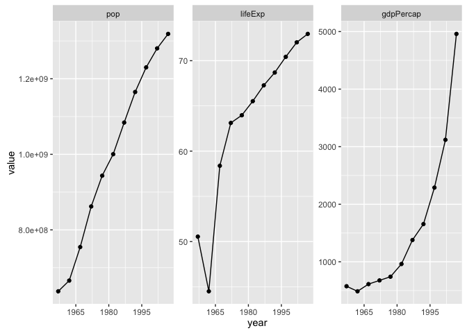
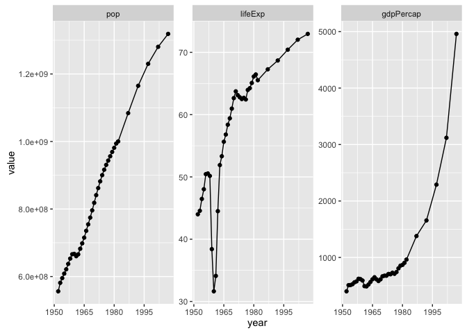

`r format(Sys.Date())`  


```r
library(readr)
suppressPackageStartupMessages(library(dplyr))
library(tidyr)
library(ggplot2)
```

There is no data for China in 1952. I have always had an incredibly low-tech 
imputation. I put it in its own script at the suggestion of Hilmar Lapp.
<https://github.com/jennybc/gapminder/issues/6>


```r
gap_dat_orig <- read_tsv("04_gap-merged.tsv")
```

See? No data for 1952.


```r
(china <- gap_dat_orig %>%
   filter(country == "China"))
```

```
## Source: local data frame [35 x 6]
## 
##    country continent  year  lifeExp       pop gdpPercap
##      (chr)     (chr) (int)    (dbl)     (int)     (dbl)
## 1    China      Asia  1953 44.55952 581390000  508.9459
## 2    China      Asia  1954 46.46560 595310000  511.0829
## 3    China      Asia  1955 48.02216 608655000  526.7440
## 4    China      Asia  1956 50.44528 621465000  560.4399
## 5    China      Asia  1957 50.54896 637408000  575.9870
## 6    China      Asia  1958 50.15840 653235000  622.4986
## 7    China      Asia  1959 38.40448 666005000  616.1922
## 8    China      Asia  1960 31.63176 667070000  591.8170
## 9    China      Asia  1961 34.10448 660330000  492.0063
## 10   China      Asia  1962 44.50136 665770000  487.6740
## ..     ...       ...   ...      ...       ...       ...
```

Why is this problem? Big picture, it's not a problem! But to teach 
visualization and data exploration, I wanted my final dataset to be extremely
clean and balanced. Ultimately, each country has data for 12 years: 1952, 
1957, 1962, ..., 2007. And I didn't want to lose a large country like China. 
So I imputed the data in order to retain it in `gapminder`.

In the past,  I imputed the China data after filtering for the years 1952,
1952, etc. so I must do that here as well.


```r
china <- china %>% 
  filter(year %% 5 == 2)
```

What does the data look like?


```r
china_tidy <- china %>%
  gather(key = "variable", value = "value",
         pop, lifeExp, gdpPercap)
ggplot(china_tidy, aes(x = year, y = value)) +
  facet_wrap(~ variable, scales="free_y") +
  geom_point() + geom_line() +
  scale_x_continuous(breaks = seq(1950, 2011, 15))
```

\ 

Begin extremely low, low tech imputation for 1952. I wouldn't necessarily do
it this way again, but I'm committed now to replicating what I did late at
night long ago.

Linear fit for GDP per capita up to 1982.


```r
china_gdp_fit <- lm(gdpPercap ~ year, china, subset = year <= 1982)
summary(china_gdp_fit)
```

```
## 
## Call:
## lm(formula = gdpPercap ~ year, data = china, subset = year <= 
##     1982)
## 
## Residuals:
##      1      2      3      4      5      6 
##  96.77 -70.32 -24.06 -38.64 -53.08  89.33 
## 
## Coefficients:
##               Estimate Std. Error t value Pr(>|t|)  
## (Intercept) -30352.549   7761.627  -3.911   0.0174 *
## year            15.755      3.941   3.998   0.0162 *
## ---
## Signif. codes:  0 '***' 0.001 '**' 0.01 '*' 0.05 '.' 0.1 ' ' 1
## 
## Residual standard error: 82.43 on 4 degrees of freedom
## Multiple R-squared:  0.7998,	Adjusted R-squared:  0.7498 
## F-statistic: 15.98 on 1 and 4 DF,  p-value: 0.01616
```

```r
(china_gdp_1952 <- china_gdp_fit %>%
  predict(data.frame(year = 1952)) %>% 
  round(6))
```

```
##        1 
## 400.4486
```

```r
## historically this has given: 400.4486 
```

Linear fit for population.


```r
china_pop_fit <- lm(pop ~ year, china)
summary(china_pop_fit)
```

```
## 
## Call:
## lm(formula = pop ~ year, data = china)
## 
## Residuals:
##       Min        1Q    Median        3Q       Max 
## -41373480 -13757147   8072377  16214710  24129710 
## 
## Coefficients:
##               Estimate Std. Error t value Pr(>|t|)    
## (Intercept) -2.797e+10  9.257e+08  -30.22 2.33e-10 ***
## year         1.461e+07  4.670e+05   31.29 1.70e-10 ***
## ---
## Signif. codes:  0 '***' 0.001 '**' 0.01 '*' 0.05 '.' 0.1 ' ' 1
## 
## Residual standard error: 24490000 on 9 degrees of freedom
## Multiple R-squared:  0.9909,	Adjusted R-squared:  0.9899 
## F-statistic: 979.2 on 1 and 9 DF,  p-value: 1.705e-10
```

```r
(china_pop_1952 <- china_pop_fit %>%
  predict(data.frame(year = 1952)) %>% 
  as.integer())
```

```
## [1] 556263527
```

```r
## historically this has given: 556263527
```

Pulling a number out of thin air for life expectancy, but no simple linear
fit was appropriate.


```r
china_lifeExp_1952 <- 44
```

Append these values to the full data frame.


```r
gap_dat_new <- rbind(gap_dat_orig,
                     data.frame(country = 'China', year = 1952,
                                pop = china_pop_1952, continent = 'Asia',
                                lifeExp = china_lifeExp_1952,
                                gdpPercap = china_gdp_1952))
gap_dat_new <- gap_dat_new %>%
  arrange(country, year)
```

Isolate the China data again for some plots.


```r
china_tidy <- gap_dat_new %>%
  filter(country == "China") %>%
  gather(key = "variable", value = "value",
         pop, lifeExp, gdpPercap)
ggplot(china_tidy, aes(x = year, y = value)) +
  facet_wrap(~ variable, scales="free_y") +
  geom_point() + geom_line() +
  scale_x_continuous(breaks = seq(1950, 2011, 15))
```

\ 

Save for now.


```r
write_tsv(gap_dat_new, "05_gap-merged-with-china-1952.tsv")

devtools::session_info()
```

```
## Session info --------------------------------------------------------------
```

```
##  setting  value                       
##  version  R version 3.2.3 (2015-12-10)
##  system   x86_64, darwin13.4.0        
##  ui       X11                         
##  language (EN)                        
##  collate  en_CA.UTF-8                 
##  tz       America/Vancouver           
##  date     2015-12-29
```

```
## Packages ------------------------------------------------------------------
```

```
##  package    * version    date       source                          
##  assertthat   0.1        2013-12-06 CRAN (R 3.2.0)                  
##  colorspace   1.2-6      2015-03-11 CRAN (R 3.2.0)                  
##  DBI          0.3.1      2014-09-24 CRAN (R 3.2.0)                  
##  devtools     1.9.1.9000 2015-12-18 Github (hadley/devtools@9aaa3af)
##  digest       0.6.8      2014-12-31 CRAN (R 3.2.0)                  
##  dplyr      * 0.4.3.9000 2015-11-24 Github (hadley/dplyr@4f2d7f8)   
##  evaluate     0.8        2015-09-18 CRAN (R 3.2.0)                  
##  formatR      1.2.1      2015-09-18 CRAN (R 3.2.0)                  
##  ggplot2    * 2.0.0      2015-12-18 CRAN (R 3.2.3)                  
##  gtable       0.1.2      2012-12-05 CRAN (R 3.2.0)                  
##  htmltools    0.2.6      2014-09-08 CRAN (R 3.2.0)                  
##  knitr        1.11.16    2015-11-23 Github (yihui/knitr@6e8ce0c)    
##  labeling     0.3        2014-08-23 CRAN (R 3.2.0)                  
##  lazyeval     0.1.10     2015-01-02 CRAN (R 3.2.0)                  
##  magrittr     1.5        2014-11-22 CRAN (R 3.2.0)                  
##  memoise      0.2.1      2014-04-22 CRAN (R 3.2.0)                  
##  munsell      0.4.2      2013-07-11 CRAN (R 3.2.0)                  
##  plyr         1.8.3      2015-06-12 CRAN (R 3.2.0)                  
##  R6           2.1.1      2015-08-19 CRAN (R 3.2.0)                  
##  Rcpp         0.12.2     2015-11-15 CRAN (R 3.2.2)                  
##  readr      * 0.2.2      2015-10-22 CRAN (R 3.2.0)                  
##  rmarkdown    0.9        2015-12-22 CRAN (R 3.2.3)                  
##  scales       0.3.0      2015-08-25 CRAN (R 3.2.0)                  
##  stringi      1.0-1      2015-10-22 CRAN (R 3.2.0)                  
##  stringr      1.0.0      2015-04-30 CRAN (R 3.2.0)                  
##  tidyr      * 0.3.1.9000 2015-12-29 Github (hadley/tidyr@d534fc7)   
##  yaml         2.1.13     2014-06-12 CRAN (R 3.2.0)
```


---
title: "05_impute-china-1952-gdpPercap.R"
author: "jenny"
date: "Tue Dec 29 23:02:26 2015"
---
