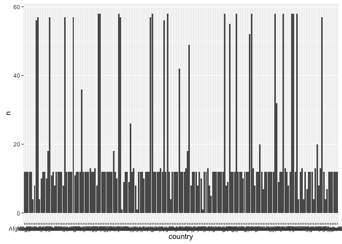
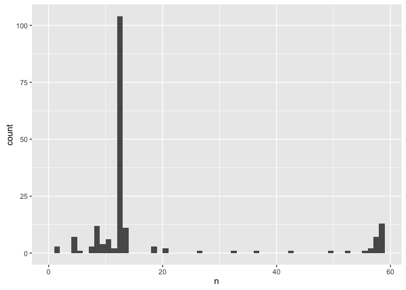
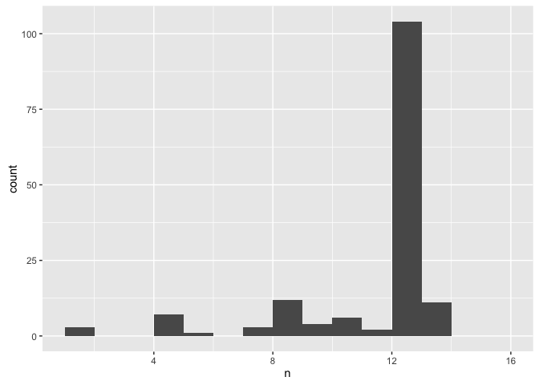
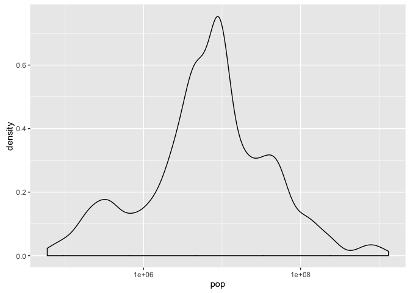
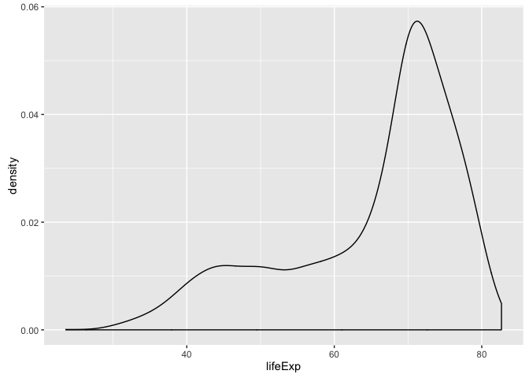
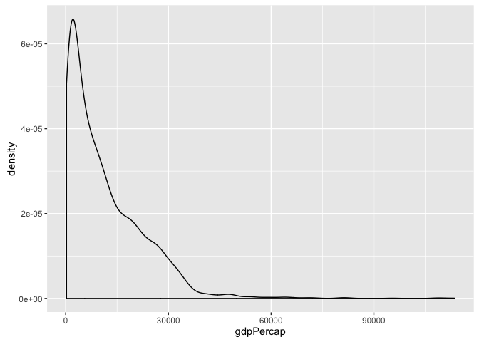

`r format(Sys.Date())`  


```r
library(plyr)
suppressPackageStartupMessages(library(dplyr))
library(ggplot2)
library(readr)

gap_dat <- read_tsv("05_gap-merged-with-china-1952.tsv") %>% 
  mutate(country = factor(country),
         continent = factor(continent))
gap_dat %>% str()
```

```
## Classes 'tbl_df', 'tbl' and 'data.frame':	3313 obs. of  6 variables:
##  $ country  : Factor w/ 187 levels "Afghanistan",..: 1 1 1 1 1 1 1 1 1 1 ...
##  $ continent: Factor w/ 6 levels "Africa","Americas",..: 3 3 3 3 3 3 3 3 3 3 ...
##  $ year     : int  1952 1957 1962 1967 1972 1977 1982 1987 1992 1997 ...
##  $ lifeExp  : num  28.8 30.3 32 34 36.1 ...
##  $ pop      : int  8425333 9240934 10267083 11537966 13079460 14880372 12881816 13867957 16317921 22227415 ...
##  $ gdpPercap: num  779 821 853 836 740 ...
```

Do we have NAs?


```r
gap_dat %>% 
  sapply(function(x) x %>% is.na() %>% sum())
```

```
##   country continent      year   lifeExp       pop gdpPercap 
##         0       301         0         0         0         0
```

year


```r
gap_dat$year %>% summary()
```

```
##    Min. 1st Qu.  Median    Mean 3rd Qu.    Max. 
##    1950    1967    1982    1980    1996    2007
```

Confirming we have 1950, 1951, ..., 2007


```r
all.equal(gap_dat$year %>% unique() %>% sort(), 1950:2007)
```

```
## [1] TRUE
```

How much data do we have for each year?


```r
ggplot(gap_dat, aes(x = year)) + geom_histogram(binwidth = 1)
```

\ 

Most countries have data every five years, e.g. 1952, 1957, 1962, and so on.
country


```r
gap_dat$country %>% str()
```

```
##  Factor w/ 187 levels "Afghanistan",..: 1 1 1 1 1 1 1 1 1 1 ...
```

```r
country_freq <- gap_dat %>%
  count(country)
ggplot(country_freq, aes(x = country, y = n)) +
  geom_bar(stat = "identity")  # ugly but worth seeing
```

\ 

```r
(p <- ggplot(country_freq, aes(x = n)) + geom_histogram(binwidth = 1))
```

\ 

```r
p + xlim(c(1, 16))
```

```
## Warning: Removed 34 rows containing non-finite values (stat_bin).
```

```
## Warning: Removed 2 rows containing missing values (geom_bar).
```

\ 

```r
country_freq$n %>% table()
```

```
## .
##   1   4   5   7   8   9  10  11  12  13  18  20  26  32  36  42  49  52 
##   3   7   1   3  12   4   6   2 104  11   3   2   1   1   1   1   1   1 
##  55  56  57  58 
##   1   2   7  13
```

Most countries have data for 12 years, i.e. the years highlighted above. Some
have data for 58 years, which I assume is the maximum. Otherwise, there's a
little bit of everything between 1 and 58.
continent


```r
gap_dat$continent %>% levels()
```

```
## [1] "Africa"   "Americas" "Asia"     "Europe"   "FSU"      "Oceania"
```

```r
gap_dat$continent %>% summary()
```

```
##   Africa Americas     Asia   Europe      FSU  Oceania     NA's 
##      613      343      558     1302      122       74      301
```

301 rows have no continent data :( but we already knew that.
Is continent data uniform for all rows pertaining to one country?


```r
tmp <- gap_dat %>%
  group_by(country) %>%
  summarize(n_continent = n_distinct(continent))
tmp$n_continent %>% table()
```

```
## .
##   1 
## 187
```

Yes, a minor miracle. All 187 countries have exactly 1 associated value of 
continent.

Fixing the continent data is a separate task to be tackled in the next
script.
population


```r
gap_dat$pop %>% summary(digits = 10)
```

```
##       Min.    1st Qu.     Median       Mean    3rd Qu.       Max. 
##      59412    2680018    7559776   31773251   19610538 1318683096
```

We have little countries


```r
gap_dat[which.min(gap_dat$pop),]
```

```
## Source: local data frame [1 x 6]
## 
##   country continent  year lifeExp   pop gdpPercap
##    (fctr)    (fctr) (int)   (dbl) (int)     (dbl)
## 1   Aruba        NA  1977   71.83 59412   7390.36
```

like Aruba w/ 60K people

and big countries


```r
gap_dat[which.max(gap_dat$pop),]
```

```
## Source: local data frame [1 x 6]
## 
##   country continent  year lifeExp        pop gdpPercap
##    (fctr)    (fctr) (int)   (dbl)      (int)     (dbl)
## 1   China      Asia  2007  72.961 1318683096  4959.115
```

like China w/ 1.3B people


```r
ggplot(gap_dat,aes(x = pop)) + geom_density() + scale_x_log10()
```

\ 

life expectancy


```r
gap_dat$lifeExp %>% summary()
```

```
##    Min. 1st Qu.  Median    Mean 3rd Qu.    Max. 
##   23.60   58.33   69.61   65.24   73.66   82.67
```

This is comptible with normal human life span. Yay.


```r
ggplot(gap_dat,aes(x = lifeExp)) + geom_density()
```

\ 

Note bimodality. Modes ~ 42 and 72.


```r
gap_dat$gdpPercap %>% summary()
```

```
##     Min.  1st Qu.   Median     Mean  3rd Qu.     Max. 
##    241.2   2505.0   7826.0  11310.0  17360.0 113500.0
```

$113K???? really?


```r
gap_dat[which.max(gap_dat$gdpPercap),]
```

```
## Source: local data frame [1 x 6]
## 
##   country continent  year lifeExp    pop gdpPercap
##    (fctr)    (fctr) (int)   (dbl)  (int)     (dbl)
## 1  Kuwait      Asia  1957  58.033 212846  113523.1
```

OIL!  Kuwait, 1957. Or maybe a data quality problem.
<https://github.com/jennybc/gapminder/issues/9>


```r
ggplot(gap_dat,aes(x = gdpPercap)) + geom_density()
```

\ 

Looks plausible. Loooong right tail.

Nothing looks completely insane. Done.

---
title: "06_smell-test-gap-merged.R"
author: "jenny"
date: "Tue Dec 29 22:21:20 2015"
---
